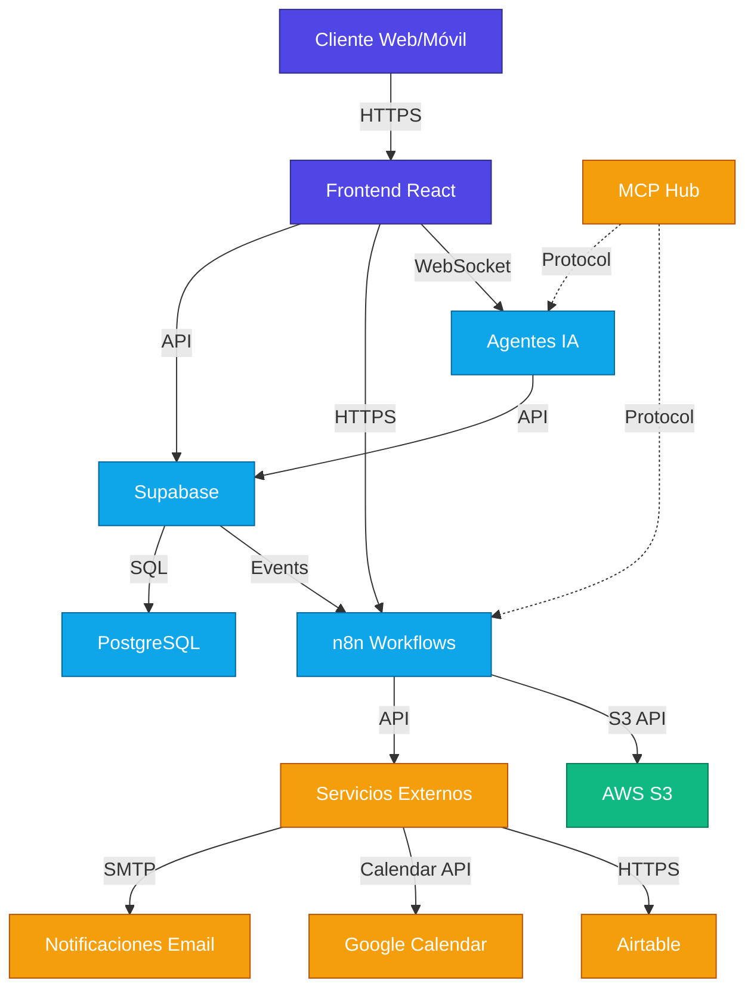
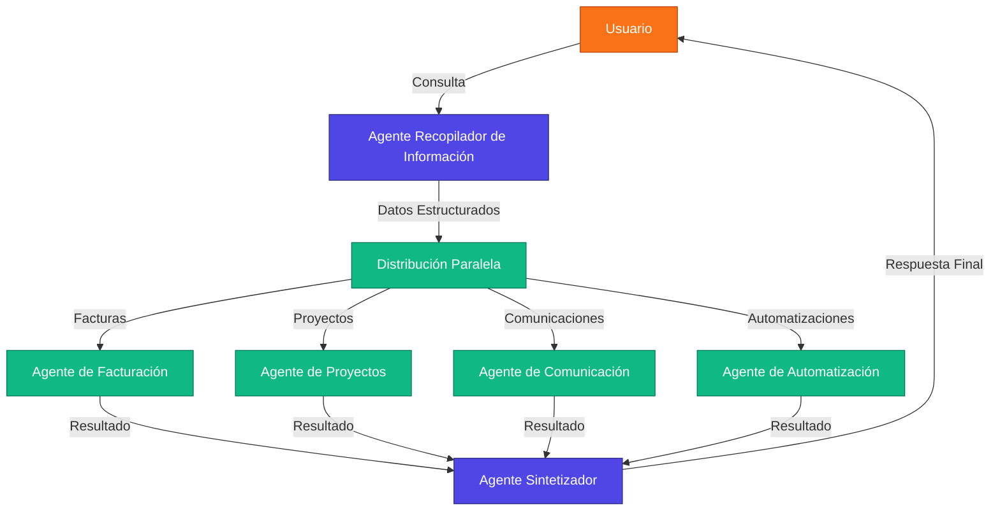

# Solar Fluidity - Plataforma Integral SaaS para Empresas Solares y Electromecánicas

<p align="center">
  
</p>

<p align="center">
  <strong>Facturación Electrónica Offline | Gestión de Proyectos | Automatizaciones con Agentes IA</strong>
</p>

<p align="center">
  <a href="#facturación-electrónica">Facturación</a> •
  <a href="#gestión-de-proyectos">Proyectos</a> •
  <a href="#automatización-con-agentes-ia">Automatización</a> •
  <a href="#guías-de-uso">Guías</a> •
  <a href="#desarrollo">Desarrollo</a> •
  <a href="#licencia">Licencia</a>
</p>

## 📋 Visión General

Solar Fluidity es una plataforma SaaS diseñada específicamente para empresas costarricenses del sector de proyectos solares y servicios electromecánicos, ofreciendo tres pilares principales:

1. **Facturación Electrónica Offline**: Genera XML/PDF válidos según la normativa fiscal de Costa Rica sin requerir conexión directa con Hacienda, otorgando mayor autonomía al usuario.

2. **Gestión de Proyectos Especializada**: Funcionalidades adaptadas a los sectores solar y electromecánico, incluyendo seguimiento de instalaciones, mantenimientos y cotizaciones.

3. **Automatización con Agentes IA**: Sistema avanzado de agentes de inteligencia artificial basados en LangGraph y Pydantic que automatizan validación de facturas, recordatorios de pago, reportes financieros y seguimiento de proyectos.

### ✨ Principales Diferenciadores

- **Control Total del Proceso Fiscal**: Genere documentos fiscales válidos sin depender de conexión a servicios externos.
- **Interfaz Adaptada al Sector**: Diseñada específicamente para proyectos solares y electromecánicos en Costa Rica.
- **Agentes IA Especializados**: Implementación de IA para automatizar tareas complejas de facturación y gestión.
- **Integraciones MCP**: Conexión con Gmail, Google Calendar, Airtable y otras herramientas mediante Model Context Protocol.

## 🏗️ Arquitectura Tecnológica

### Stack Técnico

- **Frontend**: React 18 + TypeScript + Vite
- **UI/UX**: Tailwind CSS + shadcn/ui + Framer Motion
- **Backend y Base de Datos**: Supabase (PostgreSQL)
- **Automatizaciones**: n8n
- **IA & Agentes**: LangGraph + Pydantic + FastAPI
- **Almacenamiento**: AWS S3 (documentos XML/PDF)
- **Pagos**: PayPal + Stripe (procesamiento de suscripciones)
- **Seguridad**: Autenticación Supabase, Row Level Security (RLS), HTTPS/SSL
- **Integraciones**: Model Context Protocol (MCP) para Gmail, Google Calendar, Airtable, GitHub

### Diagrama de Arquitectura



### Integraciones Principales

| Servicio | Propósito | Método de Integración |
|----------|-----------|------------------------|
| Gmail | Comunicaciones automatizadas | MCP / API REST |
| Google Calendar | Programación de actividades | MCP / API REST |
| Airtable | Gestión de datos estructurados | MCP / API REST |
| GitHub | Seguimiento de proyectos | MCP / API REST |
| PayPal | Procesamiento de pagos | API REST |
| AWS S3 | Almacenamiento de documentos | API REST |

## ✅ Funcionalidades Clave

### Facturación Electrónica

Sistema completo para generar facturas electrónicas válidas sin depender de conexión a internet:

- **Generación de XML**: Cumple con los estándares UBL 2.1 establecidos por Hacienda en Costa Rica
- **Representación Gráfica**: PDFs profesionales con todos los elementos requeridos por la ley
- **Firma Digital**: Integración con firma digital del BCCR
- **Gestión de Estados**: Seguimiento del ciclo completo (borrador → emitida → aceptada/rechazada)
- **Validación Offline**: Verificación de estructura y contenido sin necesidad de conexión
- **Almacenamiento Seguro**: Respaldo cifrado de todos los documentos fiscales

### Gestión de Proyectos

Herramientas especializadas para proyectos solares y electromecánicos:

- **Planificación**: Diseño de proyectos con estimación de capacidad, equipos y costos
- **Seguimiento**: Control de avance con hitos y etapas predefinidas para el sector
- **Calendario Integrado**: Programación de instalaciones, visitas y mantenimientos
- **Gestión de Recursos**: Asignación de personal técnico y equipos
- **Cotizaciones**: Generación de propuestas comerciales con plantillas profesionales
- **Documentación Técnica**: Repositorio de planos, permisos y especificaciones

### Automatización con Agentes IA

Sistema de inteligencia artificial basado en LangGraph y Pydantic para automatizar procesos complejos:

- **Agentes Especializados**: IAs dedicadas para facturación, proyectos y comunicaciones
- **Procesamiento de Lenguaje Natural**: Instrucciones en lenguaje conversacional para automatizar tareas
- **Validación Inteligente**: Verificación avanzada de la integridad de datos mediante modelos Pydantic
- **Flujos Cognitivos**: Generación y distribución automática de reportes con análisis contextual
- **Integraciones MCP**: Conexión nativa con servicios externos mediante Model Context Protocol
- **Ejecución Paralela**: Procesamiento simultáneo de tareas mediante grafos de agentes LangGraph

### Reportes y Análisis

Dashboards y reportes detallados para la toma de decisiones:

- **Panel Financiero**: Resumen de ingresos, gastos y rentabilidad por proyecto
- **Proyecciones**: Estimaciones de facturación y flujo de caja
- **Análisis de Eficiencia**: Métricas de rendimiento de proyectos y equipos
- **Exportación**: Descarga en Excel, PDF y otros formatos estándar
- **Reportes Personalizados**: Crea tus propios informes según tus necesidades
- **Visualizaciones**: Gráficos interactivos para entender tendencias

## 🔌 Integraciones con Model Context Protocol (MCP)

Solar Fluidity utiliza el protocolo MCP para conectarse con servicios externos de manera flexible y potente:

### Gmail MCP

Gestión completa de comunicaciones por correo electrónico:

- **Envío Automático**: Distribución programada de facturas, cotizaciones y reportes
- **Plantillas Personalizables**: Mensajes profesionales con tu imagen corporativa
- **Seguimiento**: Monitoreo de apertura y respuesta de correos importantes
- **Notificaciones**: Alertas sobre eventos críticos del proyecto o facturación
- **Flujos de Comunicación**: Secuencias de emails para diferentes etapas del proyecto
- **Archivo Digital**: Respaldo centralizado de todas las comunicaciones con clientes

### Google Calendar MCP

Programación y seguimiento temporal de todas las actividades:

- **Agenda Compartida**: Calendarios para equipo técnico y administrativo
- **Programación Inteligente**: Optimización de rutas para visitas técnicas
- **Recordatorios**: Notificaciones automáticas para hitos y entregas
- **Disponibilidad**: Control de recursos técnicos y equipamiento
- **Sincronización**: Mantén actualizados todos los calendarios automáticamente
- **Confirmaciones**: Gestión de asistencia para citas y reuniones

### Airtable MCP

Base de datos flexible para gestión de información estructurada:

- **Catálogo de Productos**: Gestión de equipos, precios y especificaciones
- **Directorio de Clientes**: Información completa y actualizada de tu cartera
- **Inventario**: Control de existencias y ubicación de equipos
- **Plantillas de Proyectos**: Bases predefinidas para diferentes tipos de instalaciones
- **Formularios**: Captura de datos en campo para técnicos e instaladores
- **Vistas Personalizadas**: Paneles adaptados a diferentes roles y necesidades

### GitHub MCP

Seguimiento de proyectos con metodologías ágiles:

- **Issues Automáticos**: Creación de tareas basadas en hitos del proyecto
- **Seguimiento**: Estado actualizado de cada componente del proyecto
- **Colaboración**: Trabajo coordinado entre equipos técnicos y administrativos
- **Documentación**: Repositorio centralizado de información técnica
- **Integraciones**: Conexión con herramientas de CI/CD para implementaciones
- **Historico**: Registro completo de cambios y decisiones en cada proyecto

### Browserbase Stagehand MCP

Automatización de navegación web para tareas repetitivas:

- **Extracción de Datos**: Obtención automática de información de portales gubernamentales
- **Verificación de Estados**: Consulta automática del estado de facturas en Hacienda
- **Llenado de Formularios**: Automatización de presentaciones y trámites online
- **Monitoreo**: Seguimiento automático de plataformas de clientes y proveedores
- **Captura de Recibos**: Obtención y archivo de comprobantes digitales
- **Validaciones**: Verificación de datos en sistemas externos

## 🛠 Configuración del Proyecto

### Requisitos Previos

- Node.js (v16+) y npm/yarn
- Cuenta en Supabase
- Cuenta en n8n (autohosting o cloud)
- Cuenta AWS (para S3) o servicio de almacenamiento alternativo
- Cuenta de PayPal Business (para procesamiento de pagos)
- Cuenta de Google con API habilitadas para Gmail y Google Calendar
- Cuenta en Airtable para bases de datos complementarias
- Configuración de MCPs (Model Context Protocol) para integraciones con servicios externos

### Instalación

```sh
# Clonar el repositorio
git clone https://github.com/KevinCElizondo/proyectosolar.git

# Navegar al directorio del proyecto
cd proyectosolar

# Instalar dependencias
npm install

# Configurar variables de entorno
cp .env.example .env
# Edita el archivo .env con tus credenciales

# Iniciar el servidor de desarrollo
npm run dev
```

### Configuración de Supabase

La aplicación utiliza Supabase como backend. Sigue estos pasos para configurar la base de datos:

1. Crea una cuenta en [Supabase](https://supabase.com)
2. Crea un nuevo proyecto
3. Obtiene la URL y la clave anónima de tu proyecto
4. Añade estas credenciales a tu archivo `.env`:
   ```
   NEXT_PUBLIC_SUPABASE_URL=https://tu-proyecto.supabase.co
   NEXT_PUBLIC_SUPABASE_ANON_KEY=tu-clave-anonima
   ```
5. Ejecuta el script de creación de tablas:
   ```bash
   cd src/integrations/mcp
   python create_supabase_tables.py
   ```
   
   Si el script falla, puedes crear las tablas manualmente en el Editor SQL de Supabase:
   
   ```sql
   -- Tabla para facturas
   CREATE TABLE IF NOT EXISTS facturas (
       id SERIAL PRIMARY KEY,
       fecha TIMESTAMP DEFAULT CURRENT_TIMESTAMP,
       cliente_nombre TEXT NOT NULL,
       cliente_cedula TEXT NOT NULL,
       subtotal DECIMAL(10, 2) NOT NULL,
       impuesto DECIMAL(10, 2) NOT NULL,
       monto_total DECIMAL(10, 2) NOT NULL,
       estado TEXT DEFAULT 'Pendiente de firma',
       xml_generado BOOLEAN DEFAULT FALSE
   );

   -- Tabla para líneas de factura
   CREATE TABLE IF NOT EXISTS factura_lineas (
       id SERIAL PRIMARY KEY,
       factura_id INTEGER REFERENCES facturas(id),
       descripcion TEXT NOT NULL,
       cantidad INTEGER NOT NULL,
       precio_unitario DECIMAL(10, 2) NOT NULL,
       subtotal DECIMAL(10, 2) NOT NULL
   );

   -- Tabla para proyectos
   CREATE TABLE IF NOT EXISTS proyectos (
       id SERIAL PRIMARY KEY,
       nombre TEXT NOT NULL,
       cliente_nombre TEXT NOT NULL,
       cliente_cedula TEXT NOT NULL,
       tipo TEXT CHECK (tipo IN ('Solar', 'Electromecánico', 'Híbrido')),
       descripcion TEXT,
       fecha_inicio DATE,
       fecha_creacion TIMESTAMP DEFAULT CURRENT_TIMESTAMP,
       estado TEXT DEFAULT 'Nuevo' CHECK (estado IN ('Nuevo', 'En progreso', 'Finalizado', 'Cancelado'))
   );
   ```

### Configuración de MCPs

El sistema utiliza Model Context Protocol (MCP) para integrar servicios externos. Este protocolo permite una comunicación estandarizada y segura con diferentes APIs y servicios.

Para configurar el MCP Hub y las integraciones, sigue estos pasos:

#### 4.3.1 Gmail MCP

```sh
# Crear directorio para credenciales de Gmail
mkdir -p ~/.gmail-mcp

# Copiar archivo de credenciales OAuth de Google
mv /ruta/del/archivo/gcp-oauth.keys.json ~/.gmail-mcp/

# Ejecutar autenticación
npx @gongrzhe/server-gmail-autoauth-mcp auth
```

#### 4.3.2 Google Calendar MCP

```sh
# Instalar el MCP de Google Calendar
npx @takumi0706/mcp-google-calendar
```

#### 4.3.3 Airtable MCP

Configurar la variable de entorno con la API key de Airtable en el archivo de configuración de MCPs.

#### 4.3.4 Archivo mcp_config.json

```json
{
  "mcpServers": {
    "github": {
      "command": "npx",
      "args": [
        "-y",
        "@modelcontextprotocol/server-github"
      ],
      "env": {
        "GITHUB_PERSONAL_ACCESS_TOKEN": "tu_token_personal_de_github"
      }
    },
    "gmail": {
      "command": "npx",
      "args": [
        "-y",
        "@gongrzhe/server-gmail-autoauth-mcp"
      ]
    },
    "google-calendar": {
      "command": "npx",
      "args": [
        "-y",
        "@takumi0706/mcp-google-calendar"
      ]
    },
    "airtable": {
      "command": "npx",
      "args": [
        "-y",
        "@felores/airtable-mcp-server"
      ],
      "env": {
        "AIRTABLE_API_KEY": "tu_api_key_de_airtable"
      }
    }
  }
}
```

## 🤖 Agentes IA y Automatizaciones

Solar Fluidity implementa un sistema avanzado de agentes de IA paralelos que reemplaza soluciones tradicionales de automatización. Estos agentes, construidos con LangGraph y Pydantic, procesan consultas en lenguaje natural y ejecutan acciones complejas de manera autónoma.

### Arquitectura de Agentes



### Configuración de Agentes IA

```bash
# Navegar al directorio de agentes IA
cd ai_agents

# Instalar dependencias de Python
pip install -r requirements.txt

# Configurar variables de entorno
cp .env.example .env
# Editar con tu clave de API de OpenAI

# Iniciar el servidor de agentes
python main.py
```

### Prompts Especializados

Cada agente utiliza prompts específicos para cumplir su función. Puedes encontrar estos prompts en el archivo `ai_agents/agents/prompts.py`. Algunos ejemplos son:

#### Prompt para Facturación Electrónica

```
Tu especialidad es la creación y gestión de facturas electrónicas siguiendo la normativa fiscal de Costa Rica.

DETALLES IMPORTANTES:
- Documentos XML deben seguir el esquema UBL 2.1 establecido por el Ministerio de Hacienda
- Es obligatorio incluir el detalle completo de impuestos (IVA del 13% general, con excepciones)
- La factura debe incluir la identificación fiscal del emisor y receptor
- Se debe especificar la condición de venta y el medio de pago
```

#### Prompt para Gestión de Proyectos

```
Tu especialidad es ayudar en la planificación, seguimiento y gestión de proyectos solares y electromecánicos.

DATO CLAVE: En Costa Rica, 1 kWp produce aproximadamente 4-5 kWh/día
```

## 📘 Guías de Uso

### 4.3 Variables de Entorno

Configurar el archivo `.env` con las siguientes variables:

```env
# Supabase
VITE_SUPABASE_URL=tu_url_de_supabase
VITE_SUPABASE_ANON_KEY=tu_clave_anonima
SUPABASE_SERVICE_ROLE_KEY=tu_clave_de_servicio

# PayPal
VITE_PAYPAL_CLIENT_ID=tu_client_id
PAYPAL_SECRET=tu_secret
PAYPAL_WEBHOOK_URL=tu_webhook_url

# AWS S3
VITE_AWS_BUCKET_NAME=nombre_bucket
VITE_AWS_REGION=region
AWS_ACCESS_KEY_ID=access_key
AWS_SECRET_ACCESS_KEY=secret_key

# Email
VITE_SMTP_HOST=tu_smtp_host
VITE_SMTP_PORT=tu_smtp_port
VITE_SMTP_USER=tu_smtp_user
VITE_SMTP_PASSWORD=tu_smtp_password

# n8n
VITE_N8N_WEBHOOK_URL=tu_webhook_url
VITE_N8N_API_KEY=tu_api_key
```

## 5. Estructura del Proyecto

```
proyectosolar/
├── src/
│   ├── components/        # Componentes React reutilizables
│   ├── pages/             # Páginas de la aplicación
│   │   ├── auth/          # Autenticación (login, registro)
│   │   ├── dashboard/     # Panel principal
│   │   ├── projects/      # Gestión de proyectos
│   │   ├── invoices/      # Facturación electrónica
│   │   ├── reports/       # Reportes financieros
│   │   └── settings/      # Configuración de cuenta
│   ├── services/          # Servicios y APIs
│   │   ├── supabase.ts    # Cliente Supabase
│   │   ├── invoice.ts     # Servicios de facturación
│   │   ├── project.ts     # Servicios de proyectos
│   │   └── n8n.ts         # Integración con n8n
│   ├── hooks/             # Custom hooks
│   ├── context/           # Contextos React
│   ├── utils/             # Utilidades y helpers
│   └── styles/            # Estilos y configuración de Tailwind
├── public/                # Archivos estáticos
├── docs/                  # Documentación
├── n8n/                   # Flujos de trabajo n8n
│   ├── workflows/         # JSON de workflows
│   └── templates/         # Plantillas para facturas XML/PDF
└── supabase/              # Configuración de Supabase
    ├── migrations/        # Scripts SQL para estructura de BD
    └── functions/         # Funciones Edge/Database
```

## 6. Configuración de Base de Datos (Supabase)

### 6.1 Tablas Principales

```sql
-- Usuarios y perfiles
CREATE TABLE profiles (
  id UUID REFERENCES auth.users NOT NULL PRIMARY KEY,
  company_name TEXT,
  tax_id TEXT,
  email TEXT,
  phone TEXT,
  address TEXT,
  created_at TIMESTAMP DEFAULT CURRENT_TIMESTAMP,
  updated_at TIMESTAMP DEFAULT CURRENT_TIMESTAMP
);

-- Proyectos
CREATE TABLE projects (
  id UUID DEFAULT uuid_generate_v4() PRIMARY KEY,
  user_id UUID REFERENCES profiles(id) NOT NULL,
  name TEXT NOT NULL,
  client_name TEXT NOT NULL,
  client_email TEXT,
  client_phone TEXT,
  description TEXT,
  start_date DATE,
  end_date DATE,
  status TEXT DEFAULT 'pending',
  total_amount DECIMAL(12,2),
  created_at TIMESTAMP DEFAULT CURRENT_TIMESTAMP,
  updated_at TIMESTAMP DEFAULT CURRENT_TIMESTAMP
);

-- Facturas
CREATE TABLE invoices (
  id UUID DEFAULT uuid_generate_v4() PRIMARY KEY,
  user_id UUID REFERENCES profiles(id) NOT NULL,
  project_id UUID REFERENCES projects(id),
  invoice_number TEXT NOT NULL,
  client_name TEXT NOT NULL,
  client_tax_id TEXT NOT NULL,
  issue_date DATE NOT NULL,
  due_date DATE NOT NULL,
  total_amount DECIMAL(12,2) NOT NULL,
  tax_amount DECIMAL(12,2) NOT NULL,
  status TEXT DEFAULT 'draft',
  xml_url TEXT,
  pdf_url TEXT,
  created_at TIMESTAMP DEFAULT CURRENT_TIMESTAMP,
  updated_at TIMESTAMP DEFAULT CURRENT_TIMESTAMP
);
```

### 6.2 Políticas de Seguridad (RLS)

```sql
-- Políticas para Perfiles
ALTER TABLE profiles ENABLE ROW LEVEL SECURITY;
CREATE POLICY "Users can view own profile" ON profiles
  FOR SELECT USING (auth.uid() = id);
CREATE POLICY "Users can update own profile" ON profiles
  FOR UPDATE USING (auth.uid() = id);

-- Políticas para Proyectos
ALTER TABLE projects ENABLE ROW LEVEL SECURITY;
CREATE POLICY "Users can view own projects" ON projects
  FOR SELECT USING (auth.uid() = user_id);
CREATE POLICY "Users can create own projects" ON projects
  FOR INSERT WITH CHECK (auth.uid() = user_id);
CREATE POLICY "Users can update own projects" ON projects
  FOR UPDATE USING (auth.uid() = user_id);

-- Políticas para Facturas
ALTER TABLE invoices ENABLE ROW LEVEL SECURITY;
CREATE POLICY "Users can view own invoices" ON invoices
  FOR SELECT USING (auth.uid() = user_id);
CREATE POLICY "Users can create own invoices" ON invoices
  FOR INSERT WITH CHECK (auth.uid() = user_id);
CREATE POLICY "Users can update own invoices" ON invoices
  FOR UPDATE USING (auth.uid() = user_id);
```

## 7. Configuración de n8n

### 7.1 Escenario de Generación de Facturas (Offline)

Configurar un workflow en n8n con los siguientes nodos:

1. **Trigger**: Webhook que recibe datos de factura desde el frontend
2. **Validación**: Función JavaScript para validar campos obligatorios
3. **Generación XML**: Función HTTP Request o CustomTool para generar XML según plantilla
4. **Generación PDF**: Función para crear PDF basado en datos y plantilla
5. **Almacenamiento S3**: Subir XML y PDF a bucket de AWS S3
6. **Actualización DB**: Actualizar registro en Supabase con URLs de los documentos
7. **Respuesta**: Devolver al frontend URLs y estatus

Importar el workflow desde `n8n/workflows/invoice_generation.json`

### 7.2 Escenario de Recordatorios de Pago

Configurar un workflow con los siguientes nodos:

1. **Trigger**: Timer (diario)
2. **Consulta DB**: Obtener facturas vencidas sin pagar
3. **Loop**: Iterar sobre facturas vencidas
4. **Plantilla Email**: Generar contenido del recordatorio
5. **Envío Email**: Enviar recordatorio al cliente
6. **Actualización DB**: Marcar recordatorio como enviado

Importar el workflow desde `n8n/workflows/payment_reminders.json`

### 7.3 Escenario de Reportes Financieros

Configurar un workflow con los siguientes nodos:

1. **Trigger**: Timer (semanal/mensual) o webhook manual
2. **Consulta DB**: Obtener datos de facturas en período seleccionado
3. **Procesamiento**: Calcular totales, pendientes, pagados
4. **Generación Excel/PDF**: Crear archivo de reporte
5. **Almacenamiento S3**: Guardar reporte en S3
6. **Envío Email**: Distribuir reporte a usuarios autorizados

Importar el workflow desde `n8n/workflows/financial_reports.json`

## 8. Pantallas Principales

### 8.1 Página de Inicio (Marketing)

- Hero section con propuesta de valor
- Características destacadas
- Planes y precios
- Testimonios
- Formulario de contacto

### 8.2 Dashboard

- Resumen de proyectos activos
- Facturas pendientes
- Ingresos del mes
- Alertas y notificaciones

### 8.3 Gestión de Proyectos

- Listado de proyectos
- Detalles de proyecto (información, hitos, costos)
- Calendario de actividades
- Documentos asociados

### 8.4 Facturación Electrónica

- Creación de facturas
- Historial de facturas emitidas
- Estado de facturas (pendiente, pagada, vencida)
- Descarga de XML/PDF

### 8.5 Reportes

- Ingresos por período
- Facturas pendientes de cobro
- Rentabilidad por proyecto
- Exportación a Excel/PDF

## 9. Plan de Implementación

### Fase 1: MVP (4-6 semanas)

- Autenticación y perfiles de usuario
- Gestión básica de proyectos
- Generación de facturas offline (XML/PDF)
- Dashboard simple
- Integración básica con n8n

### Fase 2: Automatizaciones (4-6 semanas)

- Recordatorios de pago
- Reportes financieros automatizados
- Integración con PayPal para suscripciones
- Mejoras en UX/UI

### Fase 3: Especialización (8-10 semanas)

- Módulos específicos para proyectos solares
- Herramientas para proyectos electromecánicos
- Funcionalidad offline extendida
- Mejoras de seguridad y rendimiento

## 10. Análisis de Mercado y Propuesta de Valor

### 10.1 Contexto en Costa Rica

Desde 2018, la facturación electrónica es obligatoria para todos los contribuyentes en Costa Rica. Las empresas de los sectores solar y electromecánico necesitan una solución que les permita cumplir con esta obligación mientras gestionan sus proyectos específicos.

### 10.2 Propuesta de Valor Diferenciada

- **Autonomía en Facturación**: Generación de documentos fiscales válidos sin dependencia de APIs externas.
- **Especialización Sectorial**: Funcionalidades diseñadas para proyectos solares y electromecánicos.
- **Automatización Inteligente**: Flujos de trabajo que ahorran tiempo en tareas administrativas.
- **Cumplimiento Legal**: Documentos generados bajo normativa fiscal vigente.

## 11. Responsabilidades del Usuario (Modo Offline)

- Enviar manualmente la factura a la autoridad tributaria
- Firma digital del XML si lo requiere la normativa
- Registro de aceptación o rechazo en la plataforma
- Presentación de declaraciones tributarias según la ley

## 12. Soporte y Documentación

- **Guías de usuario**: Disponibles en `/docs/user_guides/`
- **Documentación técnica**: Disponible en `/docs/technical/`
- **Soporte vía email**: support@solarfluidity.com
- **Actualizaciones**: Notificadas vía newsletter y en el dashboard

## 13. Contribución y Desarrollo

### 13.1 Guía de Contribución

1. Clonar el repositorio
2. Crear una rama para tu feature (`git checkout -b feature/amazing-feature`)
3. Commit de tus cambios (`git commit -m 'feat: add amazing feature'`)
4. Push a la rama (`git push origin feature/amazing-feature`)
5. Crear Pull Request

### 13.2 Estándares de Código

- Seguir guías de estilo ESLint
- Documentar funciones y componentes
- Escribir tests para nuevas funcionalidades
- Usar commits semánticos

## 14. Licencia

Este proyecto está licenciado bajo términos propietarios. Todos los derechos reservados.

1. **Preparación del Entorno**
```bash
# Instalar dependencias
npm install

# Configurar base de datos
npm run setup:db

# Importar workflows de n8n
npm run setup:n8n
```

2. **Configuración de Certificados**
```bash
# Crear directorio de certificados
mkdir certs
# Copiar certificado de Hacienda
cp /ruta/certificado.p12 certs/
```

3. **Iniciar Servicios**
```bash
# Iniciar todos los servicios con Docker
docker-compose up -d

# O iniciar servicios individualmente
npm run start:api
npm run start:n8n
npm run start:web
```

### 7. Verificación del Sistema

Lista de verificación para asegurar la correcta integración:

- [ ] Conexión exitosa con Supabase
- [ ] Workflows de n8n funcionando
- [ ] Integración con PayPal activa
- [ ] Comunicación con Hacienda establecida
- [ ] Envío de emails configurado
- [ ] Certificados instalados correctamente
- [ ] Backups automatizados configurados

### 8. Mantenimiento y Monitoreo

#### 8.1 Logs y Monitoreo
- Configurar logging en `/api/src/utils/logger.ts`
- Monitorear endpoints críticos en `/api/src/monitoring/health.ts`

#### 8.2 Backups
- Configurar respaldos automáticos de:
  - Base de datos
  - Certificados
  - Configuraciones de n8n

### 9. Documentación Adicional

Para información más detallada, consultar:

- `/docs/ARQUITECTURA_TECNICA.md` - Detalles técnicos y diagramas
- `/docs/GUIA_UX_UI.md` - Guías de diseño y experiencia de usuario
- `/docs/API.md` - Documentación completa de la API
- `/docs/SEGURIDAD.md` - Políticas y procedimientos de seguridad

## Contribución

1. Fork el repositorio
2. Crea una rama para tu feature (`git checkout -b feature/AmazingFeature`)
3. Commit tus cambios (`git commit -m 'Add some AmazingFeature'`)
4. Push a la rama (`git push origin feature/AmazingFeature`)
5. Abre un Pull Request

## Licencia

Este proyecto está bajo la Licencia [Especificar tipo de licencia]. Ver el archivo `LICENSE` para más detalles.

## Contacto

Kevin Cordero Elizondo - [Información de contacto]

Project Link: [https://github.com/KevinCElizondo/proyectosolar](https://github.com/KevinCElizondo/proyectosolar)
