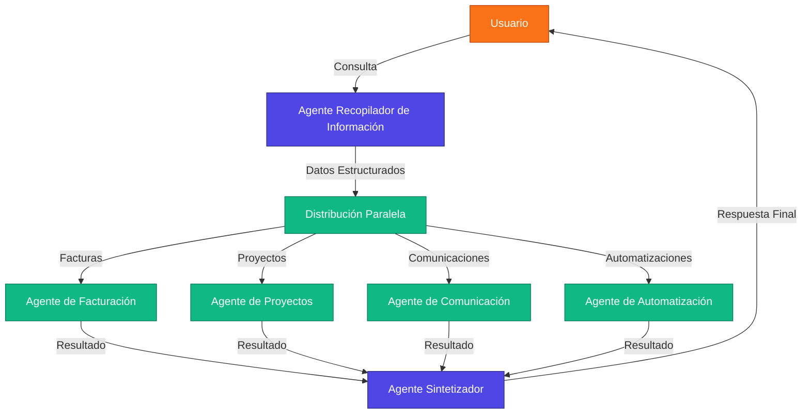

# Automatización con Agentes IA en Solar Fluidity

Esta guía detalla cómo configurar y utilizar el sistema de agentes de inteligencia artificial en la plataforma Solar Fluidity, diseñados para reemplazar soluciones tradicionales de automatización y proporcionar capacidades avanzadas para facturación electrónica y gestión de proyectos solares/electromecánicos.

## Contenido

1. [Introducción al Sistema de Agentes IA](#introducción-al-sistema-de-agentes-ia)
2. [Arquitectura de Agentes](#arquitectura-de-agentes)
3. [Componentes Principales](#componentes-principales)
   - [LangGraph](#langgraph)
   - [Pydantic](#pydantic)
   - [MCPs](#mcps-model-context-protocol)
4. [Agentes Especializados](#agentes-especializados)
   - [Agente de Facturación](#agente-de-facturación)
   - [Agente de Proyectos](#agente-de-proyectos)
   - [Agente de Comunicación](#agente-de-comunicación)
   - [Agente de Automatización](#agente-de-automatización)
5. [Flujos Automáticos](#flujos-automáticos)
   - [Recordatorio de Facturas](#recordatorio-de-facturas)
   - [Notificaciones de Hitos](#notificaciones-de-hitos)
   - [Reporte Semanal](#reporte-semanal)
6. [Configuración y Despliegue](#configuración-y-despliegue)
7. [Interacción con Agentes](#interacción-con-agentes)
8. [Personalización](#personalización)
9. [Solución de Problemas](#solución-de-problemas)

## Introducción al Sistema de Agentes IA

Solar Fluidity implementa un sistema avanzado de agentes de inteligencia artificial que sustituye soluciones tradicionales de automatización como n8n. Este enfoque proporciona varias ventajas:

- **Procesamiento de lenguaje natural**: Permite instrucciones en lenguaje conversacional
- **Toma de decisiones contextual**: Los agentes comprenden el contexto y pueden tomar decisiones más inteligentes
- **Capacidad de adaptación**: El sistema mejora con el tiempo al aprender de interacciones previas
- **Integración nativa con MCPs**: Comunicación eficiente con servicios externos

## Arquitectura de Agentes

El sistema utiliza una arquitectura paralela con agentes especializados coordinados por un agente central:



## Componentes Principales

### LangGraph

[LangGraph](https://github.com/langchain-ai/langgraph) es una biblioteca para crear aplicaciones LLM usando grafos. Permite:

- **Flujos no lineales**: Procesos complejos con bifurcaciones y decisiones condicionales
- **Ejecución paralela**: Múltiples agentes trabajando simultáneamente
- **Persistencia de estado**: Mantiene el contexto entre interacciones
- **Observabilidad**: Trazabilidad de decisiones y acciones

En Solar Fluidity, LangGraph gestiona el flujo de información entre agentes y coordina la ejecución de tareas complejas.

### Pydantic

[Pydantic](https://docs.pydantic.dev/) proporciona validación de datos y configuración mediante anotaciones de tipo Python:

- **Validación rigurosa**: Garantiza integridad de datos en todas las operaciones
- **Serialización/deserialización**: Convierte entre formatos de datos (JSON, XML)
- **Documentación automática**: Genera esquemas para APIs
- **Integración con FastAPI**: Facilita la creación de endpoints robustos

Solar Fluidity utiliza Pydantic para definir estructuras de datos (facturas, proyectos) y validar su integridad.

### MCPs (Model Context Protocol)

El Model Context Protocol conecta los agentes con servicios externos mediante interfaces estandarizadas:

- **Abstracción de servicios**: Interacción uniforme con diferentes APIs
- **Seguridad**: Gestión centralizada de credenciales y permisos
- **Extensibilidad**: Fácil incorporación de nuevos servicios

## Agentes Especializados

### Agente de Facturación

Especializado en la creación y gestión de facturas electrónicas según la normativa fiscal de Costa Rica.

**Capacidades**:
- Generación de documentos XML conformes con UBL 2.1
- Validación fiscal (cálculo de impuestos, estructura)
- Seguimiento de estados (pendiente, firmada, entregada)
- Recordatorios automáticos de pagos pendientes

**Prompts especializados**:
```python
FACTURACION_PROMPT = """
Tu especialidad es la creación y gestión de facturas electrónicas siguiendo la normativa fiscal de Costa Rica.

DETALLES IMPORTANTES:
- Documentos XML deben seguir el esquema UBL 2.1 establecido por el Ministerio de Hacienda
- Es obligatorio incluir el detalle completo de impuestos (IVA del 13% general, con excepciones)
- La factura debe incluir la identificación fiscal del emisor y receptor
- Se debe especificar la condición de venta y el medio de pago
"""
```

### Agente de Proyectos

Gestiona el seguimiento y planificación de proyectos solares y electromecánicos.

**Capacidades**:
- Seguimiento de hitos y etapas
- Gestión de recursos (personal, equipamiento)
- Calendarización de actividades
- Generación de informes de avance
- Alertas de retrasos o desviaciones

**Prompts especializados**:
```python
PROYECTOS_PROMPT = """
Tu especialidad es ayudar en la planificación, seguimiento y gestión de proyectos solares y electromecánicos.

DATO CLAVE: En Costa Rica, 1 kWp produce aproximadamente 4-5 kWh/día

TIPOS DE PROYECTOS:
1. Instalaciones solares residenciales (típicamente 1-10 kWp)
2. Instalaciones solares comerciales (10-100 kWp)
3. Trabajos electromecánicos (instalaciones, mantenimiento)
"""
```

### Agente de Comunicación

Coordina la comunicación con clientes y proveedores.

**Capacidades**:
- Envío automatizado de correos y notificaciones
- Seguimiento de respuestas
- Calendarización de reuniones
- Recordatorios personalizados

**Prompts especializados**:
```python
COMUNICACION_PROMPT = """
Tu especialidad es la comunicación eficiente con clientes y proveedores.

OBJETIVOS:
- Mantener un tono profesional y cordial en todas las comunicaciones
- Proporcionar información clara y precisa
- Dar seguimiento a consultas pendientes
- Programar recordatorios para comunicaciones de seguimiento
"""
```

### Agente de Automatización

Coordina los procesos automáticos entre los diferentes componentes del sistema.

**Capacidades**:
- Monitoreo de eventos (vencimientos, hitos)
- Ejecución programada de tareas
- Invocación de MCPs para acciones externas
- Manejo de errores y reintentos

**Prompts especializados**:
```python
AUTOMATIZACION_PROMPT = """
Tu especialidad es coordinar procesos automáticos entre diferentes componentes del sistema.

RESPONSABILIDADES:
- Monitorear eventos clave (vencimientos, hitos, plazos)
- Programar ejecución de tareas recurrentes
- Invocar MCPs para interactuar con servicios externos
- Garantizar el correcto flujo de datos entre subsistemas
- Detectar y manejar errores o excepciones
"""
```

## Flujos Automáticos

### Recordatorio de Facturas

**Objetivo**: Enviar recordatorios a clientes con facturas pendientes de pago.

**Proceso**:
1. El Agente de Automatización verifica diariamente las facturas pendientes
2. Para facturas próximas a vencer (7 días o menos), invoca al Agente de Facturación
3. El Agente de Facturación prepara los detalles relevantes mediante modelos Pydantic
4. El Agente de Comunicación genera y envía el mensaje personalizado
5. El Agente de Facturación actualiza el estado de la factura en Supabase

**Ejemplo de implementación**:
```python
class RecordatorioFactura(BaseModel):
    factura_id: int
    cliente_nombre: str
    cliente_email: str
    monto_total: float
    dias_restantes: int
    detalle_lineas: List[LineaFactura]

class RecordatorioWorker(AgentNode):
    """Agente que gestiona los recordatorios de facturas."""
    
    async def run(self):
        # Consulta diaria de facturas pendientes
        facturas = await self.db.query_facturas_pendientes()
        
        for factura in facturas:
            # Calcular días para vencimiento
            dias_restantes = (factura.fecha_vencimiento - datetime.now()).days
            
            if dias_restantes <= 7:
                # Preparar datos estructurados con Pydantic
                recordatorio = RecordatorioFactura(
                    factura_id=factura.id,
                    cliente_nombre=factura.cliente_nombre,
                    cliente_email=factura.cliente_email,
                    monto_total=factura.monto_total,
                    dias_restantes=dias_restantes,
                    detalle_lineas=factura.lineas
                )
                
                # Enviar al agente de comunicación
                await self.comunicacion_agent.notificar_recordatorio(recordatorio)
                
                # Actualizar estado
                await self.db.actualizar_estado_recordatorio(factura.id)
```

### Notificaciones de Hitos

**Objetivo**: Alertar sobre hitos próximos a cumplirse en proyectos.

**Proceso**:
1. El Agente de Automatización verifica diariamente los hitos de proyectos
2. Para hitos próximos (7 días o menos), invoca al Agente de Proyectos
3. El Agente de Proyectos prepara la información relevante del hito y proyecto
4. El Agente de Comunicación notifica a los responsables por múltiples canales
5. El Agente de Proyectos actualiza el estado de la notificación

### Reporte Semanal

**Objetivo**: Generar informes automáticos del estado de proyectos.

**Proceso**:
1. El Agente de Automatización programa la generación cada viernes
2. El Agente de Proyectos recopila datos de avance, actividades y próximos hitos
3. Utilizando modelos Pydantic, estructura la información del reporte
4. El Agente genera un análisis contextual del avance y recomendaciones
5. El Agente de Comunicación distribuye el informe a los interesados
6. Se guarda una copia en la base de datos para referencia

## Configuración y Despliegue

### Requisitos

- Python 3.9+
- Supabase (para almacenamiento y autenticación)
- API key de OpenAI o modelo compatible
- MCPs configurados para integraciones

### Instalación

```bash
# Clonar el repositorio
git clone https://github.com/KevinCElizondo/proyectosolar.git

# Navegar al directorio de agentes
cd proyectosolar/ai_agents

# Instalar dependencias
pip install -r requirements.txt

# Configurar variables de entorno
cp .env.example .env
# Editar .env con tus claves API
```

### Archivo requirements.txt

```
langchain>=0.0.267
langgraph>=0.0.10
pydantic>=2.0.0
fastapi>=0.100.0
uvicorn>=0.22.0
supabase>=1.0.3
openai>=1.0.0
python-dotenv>=1.0.0
```

### Ejecución

```bash
# Iniciar el servidor de agentes
python main.py

# El servidor estará disponible en: http://localhost:8000
```

## Interacción con Agentes

### API REST

Endpoint principal:
```http
POST /api/chat
```

Cuerpo de la solicitud:
```json
{
  "message": "Necesito generar una factura para el cliente ACME por 3 paneles solares",
  "agent_type": "facturacion"
}
```

Respuesta:
```json
{
  "response": "He generado una factura para ACME por la instalación de 3 paneles solares. El monto total es de ₡1,500,000 con un IVA de ₡195,000. Puedes revisar y firmar la factura en tu panel de control.",
  "actions": [
    {
      "type": "create_invoice",
      "data": {
        "invoice_id": 123,
        "client": "ACME",
        "total": 1500000,
        "tax": 195000
      }
    }
  ]
}
```

### Interfaz Conversacional

Los usuarios pueden interactuar con los agentes a través de una interfaz conversacional en la aplicación web, donde pueden:

- Solicitar la generación de facturas
- Consultar el estado de proyectos
- Programar recordatorios
- Configurar flujos automáticos

## Personalización

### Modificación de Prompts

Los prompts de cada agente pueden personalizarse editando el archivo `ai_agents/agents/prompts.py`:

```python
# Ejemplo: Personalizar el prompt del agente de facturación
FACTURACION_PROMPT = """
[Tu prompt personalizado aquí]
"""
```

### Definición de Nuevos Flujos

Para crear nuevos flujos automáticos:

1. Define un nuevo modelo Pydantic para estructurar los datos
2. Implementa un nuevo nodo de agente en `ai_agents/agents/automation.py`
3. Regístralo en el grafo de agentes en `ai_agents/graph.py`

```python
# Ejemplo: Nuevo flujo para seguimiento de garantías
class SeguimientoGarantia(BaseModel):
    proyecto_id: int
    cliente_id: int
    fecha_instalacion: datetime
    equipos: List[EquipoInstalado]
    duracion_garantia: int  # en meses

class GarantiaWorker(AgentNode):
    """Agente que gestiona el seguimiento de garantías."""
    
    async def run(self):
        # Implementación del flujo
        ...
```

## Solución de Problemas

### Problemas Comunes

| Problema | Posible Causa | Solución |
|----------|---------------|----------|
| Agente no responde | Error de conexión a OpenAI | Verificar API key y conectividad |
| Datos incorrectos | Fallo en validación Pydantic | Revisar estructura de datos enviados |
| MCP falla | Credenciales o permisos incorrectos | Verificar configuración de MCP |
| Notificaciones no enviadas | Error en servicios externos | Comprobar logs y reintentar |

### Logs y Monitoreo

Los logs detallados se guardan en `ai_agents/logs/` y proporcionan información sobre:

- Interacciones con los agentes
- Ejecución de flujos automáticos
- Errores y excepciones
- Uso de MCPs

Para habilitar logs más detallados:
```bash
export LOG_LEVEL=DEBUG
python main.py
```

## Recursos Adicionales

- [Documentación de LangGraph](https://github.com/langchain-ai/langgraph)
- [Documentación de Pydantic](https://docs.pydantic.dev/)
- [Guía de Model Context Protocol (MCP)](/docs/Integraciones/INTEGRACION_MCP_API.md)

---

Para obtener ayuda adicional, contacta al equipo de soporte de Solar Fluidity en soporte@solarfluidity.com
