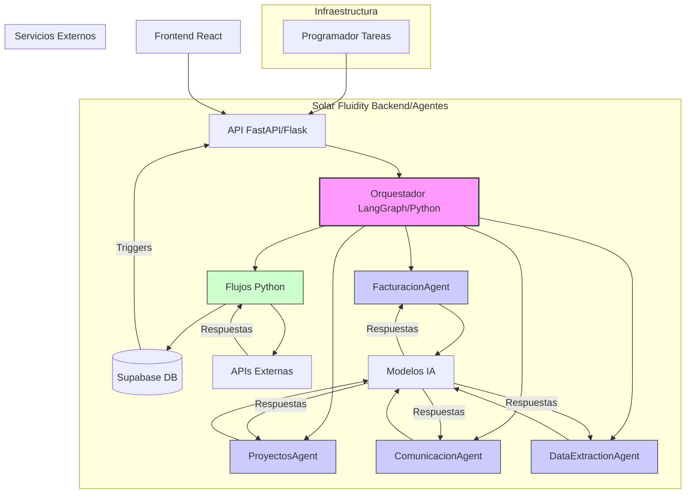

# Sistema de Automatización con Agentes IA / Python

Solar Fluidity utiliza un sistema de automatización avanzado basado en **Agentes de Inteligencia Artificial (IA)** y **flujos de trabajo definidos en Python**. Este enfoque reemplaza las herramientas de automatización visual tradicionales, ofreciendo mayor flexibilidad, potencia y capacidad de adaptación para las tareas complejas relacionadas con la facturación electrónica y la gestión de proyectos solares.

## Arquitectura de Automatización

La arquitectura se basa en los siguientes componentes:

1.  **Orquestador de Agentes (Python)**: Un componente central, a menudo implementado con librerías como LangGraph o frameworks similares, que coordina la ejecución de diferentes agentes IA y flujos de Python.
2.  **Agentes IA Especializados**: Módulos de IA (potenciados por modelos como GPT, Claude, etc.) entrenados o instruidos para realizar tareas específicas:
    *   `FacturacionAgent`: Análisis de datos de facturas, validación según normativa, generación de sugerencias.
    *   `ProyectosAgent`: Seguimiento de hitos, asignación de recursos, generación de reportes de avance.
    *   `ComunicacionAgent`: Redacción de correos, respuestas a consultas de clientes, notificaciones.
    *   `DataExtractionAgent`: Extracción de información relevante de documentos (PDFs, XMLs).
3.  **Flujos de Trabajo Python**: Scripts de Python que definen la lógica de negocio paso a paso, interactuando con la base de datos (Supabase), APIs externas (Hacienda, PayPal) y los agentes IA.
4.  **API de Agentes (FastAPI/Flask)**: Un endpoint API que expone las funcionalidades de los agentes y permite la interacción desde el frontend u otros servicios.
5.  **Base de Datos (Supabase)**: Almacena el estado de los flujos, los datos necesarios para las automatizaciones y los resultados. Se utilizan triggers y funciones de base de datos para iniciar ciertos flujos.
6.  **Programador de Tareas (Celery, APScheduler, o similar)**: Para ejecutar flujos de trabajo de forma periódica (ej. recordatorios de pago, reportes semanales) o en segundo plano.

## Ventajas del Enfoque IA/Python

*   **Flexibilidad**: Permite implementar lógica compleja y adaptativa que sería difícil o imposible con herramientas visuales.
*   **Potencia**: Aprovecha las capacidades de los modelos de lenguaje grandes para tareas como análisis de texto, generación de contenido y toma de decisiones.
*   **Mantenibilidad**: El código Python es versionable, testeable y más fácil de mantener a largo plazo por desarrolladores.
*   **Integración Profunda**: Permite una integración más estrecha con la lógica de negocio específica de Solar Fluidity.
*   **Escalabilidad**: Los componentes pueden escalarse independientemente según la carga.

## Implementación

*   El código fuente de los agentes y flujos se encuentra principalmente en el directorio `/ai_agents`.
*   Se utiliza FastAPI para exponer la API de los agentes (`/ai_agents/main.py`).
*   Las dependencias se gestionan a través de `requirements.txt` (`/ai_agents/requirements.txt`).
*   La configuración (API keys, etc.) se maneja mediante variables de entorno (archivo `.env`).

## Ejemplos de Flujos Automatizados

1.  **Generación Asistida de Facturas**:
    *   Usuario ingresa datos básicos en el frontend.
    *   Se llama a la API de agentes.
    *   `FacturacionAgent` valida datos, consulta historial del cliente (vía Supabase), sugiere ítems o completa información faltante usando IA.
    *   Flujo Python genera el XML/PDF final.
2.  **Recordatorio Inteligente de Pagos**:
    *   Un programador de tareas ejecuta un flujo Python diariamente.
    *   El flujo consulta facturas vencidas en Supabase.
    *   `ComunicacionAgent` redacta un email de recordatorio personalizado para cada cliente, adaptando el tono según el historial de pagos.
    *   El flujo envía los correos a través de una API de email.
3.  **Actualización Automática de Estado de Proyecto**:
    *   Un agente monitorea correos o eventos de calendario (vía APIs externas).
    *   `ProyectosAgent` interpreta el contenido (ej. "Instalación completada en sitio X") y actualiza el estado del proyecto correspondiente en Supabase.
    *   Se notifica al gestor del proyecto.

Este sistema proporciona una base robusta y adaptable para las necesidades de automatización presentes y futuras de Solar Fluidity.
